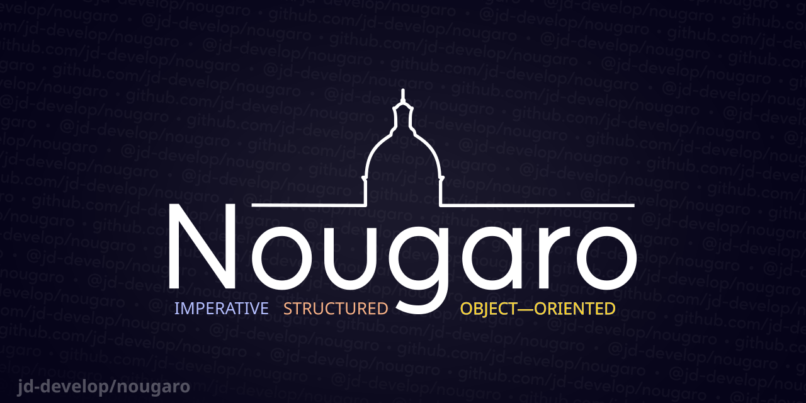

# Nougaro

[English](README.md)



Voici Nougaro version `1.1.0`.

 Nougaro est un langage de programmation, interprété en Python.

C’est un langage multi-paradigmes qui supporte la programmation impérative, fonctionelle, et orientée-objet.

Nougaro est faiblement typé. Sa syntaxe est inspirée de celles de Python et de Basic.

## Exemple
```nougaro
def fizzbuzz(n)
    for i = 0 to n then
        if i%15 == 0 then print("FizzBuzz") \
        elif i%3 == 0 then print("Fizz") \
        elif i%5 == 0 then print("Buzz") \
        else print(i)
    end
end
```

## Exécuter

 Exécutez le shell avec `python3 shell.py`. Ouvrez des fichiers avec `python3 shell.py nomdufichier.extention`.
 Généralement, on utilise l'extension `.noug` pour les fichiers Nougaro.

 Le code est compilé pour Windows et GNU/Linux. Disponible dans l'onglet [releases](https://github.com/jd-develop/nougaro/releases/)&nbsp;!
 
 Prend en charge Python 3.11 et 3.12. N’a pas été testé sous Python 3.13.

### Modules tiers (optionnels)

 Modules pas toujours fournis avec Python&nbsp;:

* `colorama` (`pip install colorama`)

 Sous GNU/Linux, pour permetter de naviguer dans l’historique des commandes en
 utilisant les flèches du clavier, ainsi que pour sauvegarder l’historique de
 commandes&nbsp;:

* `readline` (`pip install readline`)

## Documentation

 La documentation est disponible [ici](https://nougaro.github.io/documentation) (en anglais uniquement).

## Deux mots sur la coloration syntaxique

 Le fichier notepad++ n’était plus mis à jour, donc je l’ai supprimé du dépôt. Voici sa [dernière version](https://github.com/jd-develop/nougaro/blob/973303409d2f7a91d1b45e44f57ebdb517abde53/highlight%20theme%20for%20NPP.xml).

 Je prévois de créer une [extension VSCode](https://github.com/jd-develop/nougaro-highlight-theme) – si vous vous y connaissez, contactez-moi&nbsp;!

## Comment ça marche&nbsp;?

 Tout est expliqué [ici](how_it_works.md) (en anglais…)

## Buts du langage

 Le but principal du langage est de me permettre de comprendre comment fonctionnent les langages
 interprétés. Il n’est pas conçu pour être super rapide, sécurisé en terme de mémoire et de
 dernière-génération, mais plutôt pour être facilement compréhensible.

> [!Important]
> Je ne recommande pas l’utilisation de Nougaro dans des vrais projets.

## Remerciements

 Merci à [Mistera](https://github.com/mistera91) qui contribue épisodiquement.

 Merci à [3fxcf9](https://github.com/3fxcf9) pour la [bannière du dépôt](repo-image/repo-image.png).
