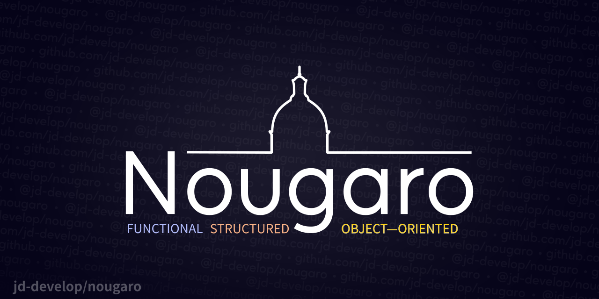

# Nougaro

This is Nougaro beta 0.16.0.

## English description

 A programming language. Interpreter written in Python.

### Third-party modules (optional)

 Python builtins that are not always builtin (why?):

* `colorama` (`pip install colorama`)

 Under Linux:

* `readline` (`pip install readline`)

### Run

 Execute the shell with `python3 shell.py`. Open files with `python3 shell.py filename.extension`.
 Generally, we use `.noug` as extension for Nougaro files.

 The code is compiled for Windows and Linux. Check it out in the [releases](https://github.com/jd-develop/nougaro/releases/) tab!

 Minimum : Python 3.11

 Supports Python 3.11 and 3.12

## French description

 Un langage de programmation. Interpréteur écrit en Python.

### Modules tiers (optionnels)

 Modules pas toujours fournis avec Python (pourquoi&nbsp;?)&nbsp;:

* `colorama` (`pip install colorama`)

 Sous Linux&nbsp;:

* `readline` (`pip install readline`)

### Exécuter

 Exécutez le shell avec `python3 shell.py`. Ouvrez des fichiers avec `python3 shell.py nomdufichier.extention`.
 Généralement, on utilise l'extension `.noug` pour les fichiers Nougaro.

 Le code est compilé pour Windows et Linux. Disponible dans l'onglet [releases](https://github.com/jd-develop/nougaro/releases/)&nbsp;!

 Minimum : Python 3.11

 Prend en charge Python 3.11 et 3.12

## Documentation

 Please refer to the [wiki](https://github.com/jd-develop/nougaro/wiki/) for documentation.

## About syntax highlighting

 The notepad++ file was no longer updated, so I deleted it from the repo.

 I’m planning to create a VSCode extension – if you know something about that, contact me!

## How it works?

 Everything is explained [here](how_it_works.md) :)

Enjoy :)
